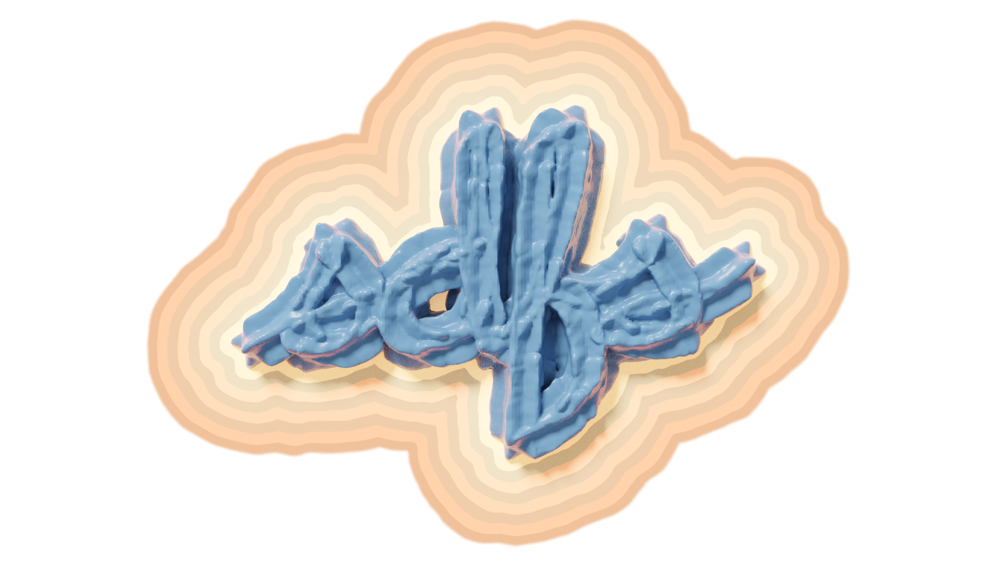

# Constructive Solid Geometry on Neural Signed Distance Fields



This code accompnies the paper ["Constructive Solid Geometry on Neural Signed Distance Fields"](https://zoemarschner.com/research/csg_on_neural_sdfs.html) by Zoë Marschner, Silvia Sellán, Derek Liu, and Alec Jacobson.

## Installation

Create a virtual enviroment if desired, then install the dependencies (matplotlib and pytorch):

```
pip3 install torch
pip3 install matplotlib
```

Matplotlib is only needed for visualization, so if you want to train the model on a seperate device with a GPU, you
will only need to install pytorch there. 

## Running
To train networks for example CSG and SV problems, run either `ex_csg.py` or `ex_sv.py`—you will likely want to train these on a GPU. The results of these are also precomputed, and can be found in the `models/` and `data/` folders. Results can be visualized using `viz_ex.py`. For example, run either:

```
python3 viz_ex.py swept_star -1.05 2.05 -0.9 2.2
python3 viz_ex.py circle_square_union
```

to visualize the precomputed results! (adding `-s` as an argument at the end of these commands will save the resulting images). 

## Organization

The core contribution of our paper is the losses defined in `nsdf_csg_losses.py`, where you will find the closest point loss and the editing losses. 

## Coming Soon

Check back soon for additional examples, including 3D examples!